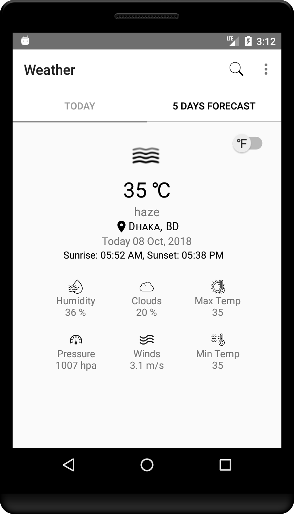
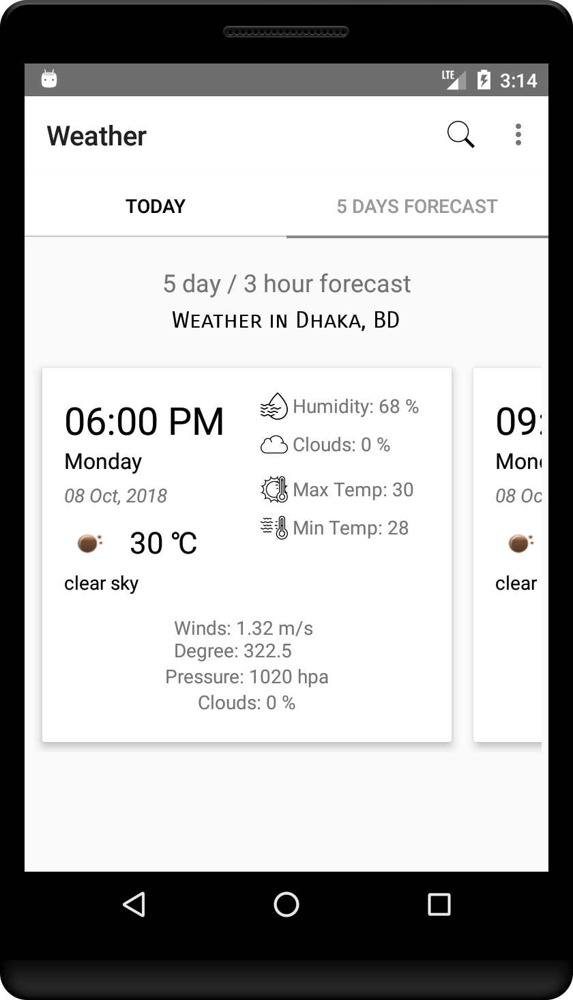
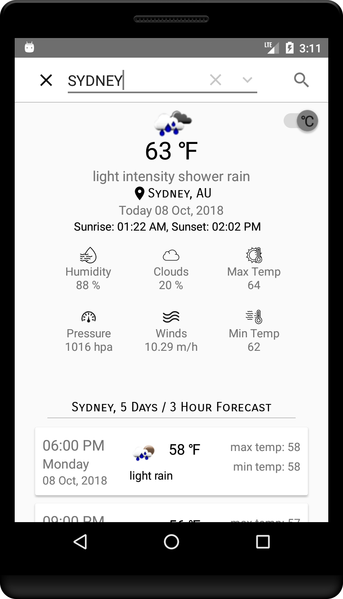

# *Weather App*
> _professional android weather app, web api_

### App features for learner/developer-
* Using => Tab layout, Fragments, RecyclerView, Retrofit2, Gson, Picasso
* Using OpenWeatherMap API 
* Choose Celsius => fahrenheit  with SharedPreference
* Retrieve Current weather data and 5 day / 3 hour forecast data using API
* Working with Current Location using GPS / Cellular Network
* Searching City to know weather
* Notification with UV alert and more

#### Some Screenshots of this app
 Current Weather                            | 5 Days Forecast                             | Search Weather by City                         		                    
:------------------------------------------:|:-------------------------------------------:|:-------------------------------------------:
  |  |  

